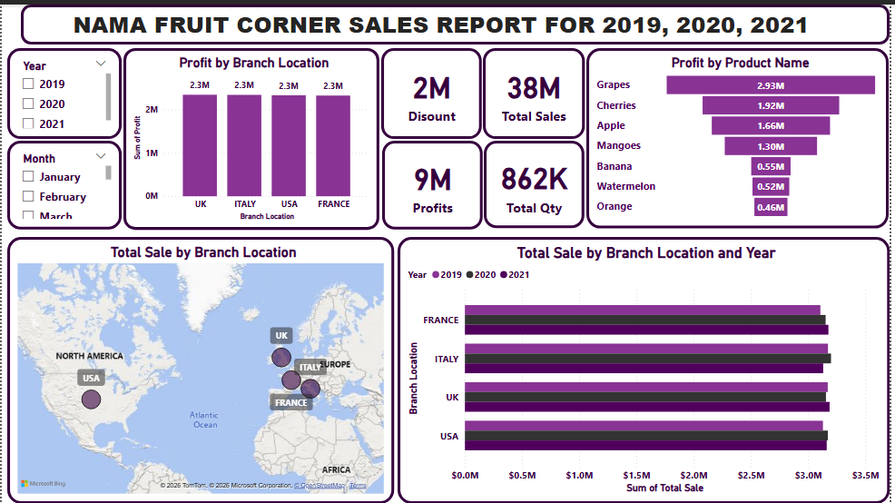

[nama-sales-README.md](https://github.com/user-attachments/files/28214324/nama-sales-README.md)
# Nama-sales# Nama Fruit Corner Sales Dashboard 🍇

A Power BI dashboard analysing sales performance for Nama Fruit Corner across four international branch locations (UK, Italy, USA, France) from 2019 to 2021.

---

## Problem Statement

The business needed a clear view of which products, branches, and time periods were driving revenue and profit — and which weren't pulling their weight across a 3-year window.

---

## Dashboard Overview

| Metric | Value |
|---|---|
| Total Sales | ₦38M |
| Total Profits | ₦9M |
| Total Discount Given | ₦2M |
| Total Quantity Sold | 862K units |

**Tool:** Power BI  
**Data period:** 2019 – 2021  
**Scope:** 4 branch locations across Europe and North America

---

## Key Visuals

- **Profit by Branch Location** — All four branches (UK, Italy, USA, France) delivered equal profit of ₦2.3M each, suggesting consistent operations across regions
- **Profit by Product Name** — Grapes led with ₦2.93M in profit, followed by Cherries (₦1.92M) and Apple (₦1.66M); Orange was the lowest at ₦0.46M
- **Total Sale by Branch Location & Year** — France ranked highest in total sales; performance tracked year-on-year across 2019, 2020, and 2021
- **Geographic Map** — Visual distribution of branch locations across North America and Europe
- **Slicers** — Year (2019/2020/2021) and Month filters for dynamic exploration

---

## Key Insights

- Despite equal profit across all four branches, France led in total sales volume — suggesting higher discount activity or lower-margin products in that region
- Grapes alone account for a significant share of total profit, making it the most valuable product in the portfolio
- The flat profit-by-branch pattern across three years indicates either standardised pricing or a structural cap on growth — worth investigating at the unit-economics level

---

## Skills Demonstrated

- Data modelling and relationship building in Power BI
- DAX measures for profit, discount, and quantity calculations
- Time-series analysis with year and month slicers
- Geographic visualisation using map visuals
- Insight generation from comparative branch performance

---

## Dashboard Preview

---

## Tools Used

`Power BI` `DAX` `Data Modelling` `Data Visualisation`
